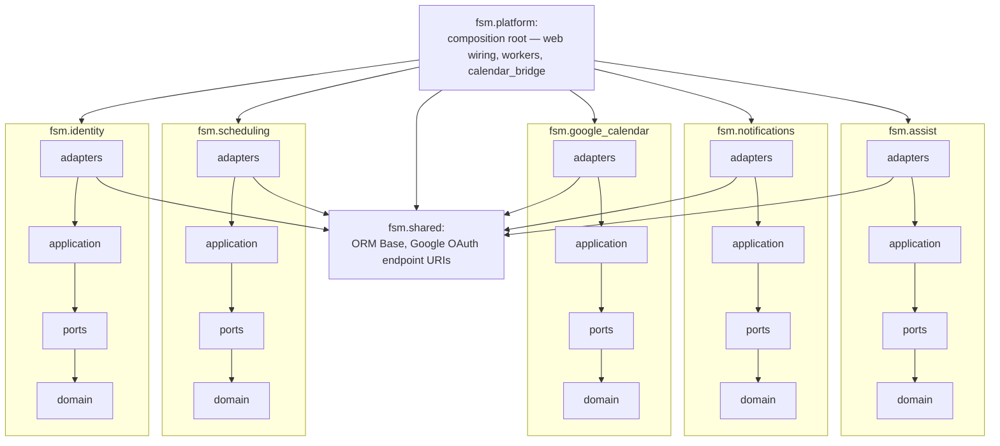

# Field Service Management

[](https://github.com/erancha/field-service-management/actions/workflows/ci.yml)

A platform for service agencies (think elevator or appliance maintenance) that runs the whole job
lifecycle from a single source of truth.

**Contents:** [What's built](#whats-built) · [Roadmap](#roadmap) · [Overview](#overview) · [Getting started](#getting-started) · [Scripts](#scripts) · [Testing](#testing) · [Architecture](#architecture) · [Authentication & live communication](#authentication--live-communication) · [Database schema](#database-schema) · [License](#license)

## What's built

Everything below is running today. Everything not below is in the [Roadmap](#roadmap).

### Sign-in and roles

Google OIDC is the only sign-in path, so its environment variables are required configuration and
every booking or scheduling action needs a signed-in session. There are three roles — customer,
technician, and admin — and a role comes from the per-role edge that completed the sign-in, never
from client input. An admin approves a technician before they can be booked.

### Booking and scheduling

- Customers book themselves, against a technician's real availability.
- **No double-booking is enforced by the database**, not by application checks: a GiST exclusion
  constraint rejects any overlapping appointment for the same technician.
- Availability subtracts per-technician working hours and time off, central holiday exclusions, and
  the technician's Google free/busy.
- Either side can reschedule or cancel; every booking action lands in an append-only audit.

### Google Calendar, both directions

- **Outbound:** every appointment is projected to the technician's calendar through a transactional
  outbox, so a calendar failure can never lose a booking that the database accepted.
- **Inbound:** a poll reconciles edits the technician made on Google's side.
- The customer is added as a **real guest**, so Google itself delivers the invite, updates, and
  cancellation.
- A guest declining or deleting the event cancels the appointment. A guest moving the event is
  validated against the technician's availability, and reverted with a notification when the new
  time is not bookable.
- The technician's event carries the triage summary laid out as HTML — the fault and symptoms and
  what to do first, then the equipment, suspected cause, and what has been ruled out.

### Notifications

An in-app feed for both parties, plus an email to the technician. Email is configured by environment
variables and degrades gracefully when unset — the feed row is still written.

### The customer's triage assistant

**An assistant today, an agent on the way.** The model holds the conversation and marks when triage
is over; the code around it takes the one action that follows — opening the service call. The model
calls no tools; letting it act across the call lifecycle is what would make it an agent.

Replies are grounded in the back-office knowledge base by retrieval-augmented generation: every
customer turn is embedded, the nearest chunks come back from pgvector and enter the system prompt as
reference material the model follows and cites by document name, falling back to its own knowledge
when no uploaded document covers the topic. Retrieval repeats per turn, because the topic can move
mid-chat.

The chat appears when `ASSIST_MODEL` and its provider's API key are set; with them unset the
customer sees the plain description form instead, and switching between an Anthropic and an OpenAI
model is a change to `ASSIST_MODEL` and its key, with no code change. The assistant suggests only
steps that are safe for a customer to try — never gas, mains wiring, refrigerant, or working at
height.

A conversation ends one of three ways:

- **Solved** — the customer confirms the problem is fixed.
- **Escalated** — a service call is opened carrying the summary, after which the customer books a
  technician through the same flow as before.
- **Closed** — it was never an equipment fault, or the customer asked to stop. Booking nothing is
  the point, so asking to leave never books a visit. Both the assistant and an End chat button can
  close one.

The summary is **stored as structure, not prose**: the service call keeps the fields as JSON, and
one layout definition drives the calendar event's HTML, the appointment card, and the notification
email, so no surface reads a rendering back apart.

Around the edges: a conversation that runs long escalates on its own, because each turn re-sends the
whole exchange and a customer still stuck that far in needs a visit; one left quiet for 24 hours is
retired; a customer has at most one active conversation, enforced by a partial unique index; replies
stream to the browser and survive a page reload; ended conversations stay readable, newest first;
and a conversation nobody typed into never appears. Opening a service call never depends on the
assistant — a turn the model cannot answer offers the plain description form as a way through.

### Photos in the chat

A customer can attach up to five photos per conversation (JPEG, PNG, or WebP, 5 MB each) — a rating
plate, a display error code, the state of a part.

- The assistant never sees the original: it gets a downscaled, EXIF-stripped copy (long edge
  1280px), reads what it shows, and quotes back a model number or error code it can make out.
- It stops suggesting steps and escalates the moment a photo shows a risk signal — scorch marks,
  exposed wiring, water near electrics, gas fittings.
- Originals live in the bundled MinIO service; Postgres keeps only metadata rows, never photo bytes.
- Every non-escalated ending reclaims the conversation's photos. For a 24-hour retirement that
  reclamation is lazy, done when the customer next opens the chat, not by a background job.
- An escalated ending carries the sent photos onto the service call as attachments, shown as preview
  thumbnails on the technician's appointment card. The original is downloadable by the call's
  customer, a technician with an appointment on the call, or an admin — no one else.
- Calendar events carry the call's text summary, never a photo.
- Both the images and the problem text are sent to the configured chat-model provider, the same
  third-party posture as the rest of the chat.

### Knowledge base

The back office uploads the documents the assistant answers from. An upload is chunked, embedded,
and indexed into pgvector; a byte-identical re-upload is rejected rather than indexed twice; and the
panel stays usable as the library grows.

### Deployment

`./scripts/start.sh` runs the whole stack locally in Docker or as host processes
([Getting started](#getting-started)). `scripts/deploy-to-ec2/` serves the three role apps publicly
from a single ARM EC2 box over HTTPS, with certificates renewed in the background.

## Roadmap

The [vision document](https://docs.google.com/document/d/1bX7L_CL6hBIfpJVCkpRFYk6hIZ7OxD7dSugnPWCKLsY/edit)
describes the full product. What is not built yet is tracked as issues rather than described here, so
this page stays a record of what runs and the tracker stays the record of what is next. Everything
below carries the [`Long term`](https://github.com/erancha/field-service-management/labels/Long%20term)
label; smaller follow-ups live in the tracker alongside them.

| Track | Open work |
|---|---|
| Back office | [#81](https://github.com/erancha/field-service-management/issues/81) customers, sites, and contacts · [#82](https://github.com/erancha/field-service-management/issues/82) asset catalog and fault history · [#83](https://github.com/erancha/field-service-management/issues/83) call lifecycle past SCHEDULED, with a dispatch board · [#90](https://github.com/erancha/field-service-management/issues/90) search · [#91](https://github.com/erancha/field-service-management/issues/91) parts and inventory |
| Technician field app | [#84](https://github.com/erancha/field-service-management/issues/84) route and navigation · [#85](https://github.com/erancha/field-service-management/issues/85) check-in/out and time logging · [#86](https://github.com/erancha/field-service-management/issues/86) service report, signature, signed PDF · [#87](https://github.com/erancha/field-service-management/issues/87) offline use |
| Customer app | [#89](https://github.com/erancha/field-service-management/issues/89) live status, on-the-way alert, report download |
| Platform | [#88](https://github.com/erancha/field-service-management/issues/88) push and SMS channels · [#92](https://github.com/erancha/field-service-management/issues/92) audit trail across the lifecycle |

## Overview

- **Backend** (`backend/`): Python 3.12+, FastAPI, SQLAlchemy 2.x + PostgreSQL, Alembic.
- **Frontend** (`frontend/`): a modular React (Vite + TypeScript) app.
- **Source of truth** is the Postgres database; external systems (Google Calendar) are downstream
  projections reached through ports, never imported by the core.

## Getting started

Prerequisites: **Python ≥3.12**, **Docker**, and **Node.js 22+ with npm**.

### 1. Configuration (`backend/.env`)

```bash
./scripts/init-env.sh   # writes backend/.env from backend/.env.example, generating FSM_TOKEN_KEY + SESSION_SECRET
```

Configuring the **Google Cloud Console** OAuth client is mandatory. Google is the only sign-in path,
and every booking and scheduling action requires a signed-in session, so the app does nothing useful
until it is set. `init-env.sh` handles the rest of the baseline — `DATABASE_URL`/`APP_ENV` default to
the bundled Docker Postgres and the two local secrets are generated for you. Holidays and email are
the only features that stay disabled, without error, when left unset.

Each key — what it does, when it is required, and how to obtain it — is documented inline in
[`backend/.env.example`](backend/.env.example), which also contains the Google Cloud Console setup
steps. Refer to it there rather than duplicating the list here.

### 2. Runtime

One launcher, **one** `backend/.env`, two run modes that reach the roles at the **same URLs**, each
completing Google sign-in. Docker is the default (a closer-to-production stack); `--host` runs the
roles as local uvicorn processes for fast boot and debugger attach. Either way PostgreSQL and Redis
run in Docker.

```bash
# DOCKER mode (default): roles run as containers; nginx publishes one localhost port per role
./scripts/start.sh                   # all roles: db + redis + migrations + backends + nginx
./scripts/start.sh technician        # one role (alias tec) -> http://localhost:8001

# HOST mode (--host): each role is a local uvicorn process on the same ports
./scripts/start.sh --host                # all roles            -> :8001 / :8002 / :8003
./scripts/start.sh technician --host     # one role (alias tec) -> http://localhost:8001
```

The launcher is idempotent and requires `backend/.env` (step 1) — it aborts with instructions if
that file is missing. Docker mode builds the backend image and brings the roles up as compose
services; `--host` provisions the virtualenv, builds the frontend, and runs one uvicorn per role.
Each mode starts PostgreSQL and Redis via Docker and applies migrations first. Edit `backend/.env`
and re-run to pick up changes. In either mode every role serves its React UI at `/`, API docs at
`/docs`, and `/health` + `/ready` for liveness and readiness. Bring the stack down or tail logs with
`./scripts/docker-helper.sh --stop` / `--logs`.

#### Open a UI in your browser

Each role is reached on its own `localhost` port — the same in either mode. In Docker mode nginx
serves the SPA and proxies the API per port; in host mode the uvicorn process serves the SPA and API
directly.

| App | URL |
|---|---|
| Technician | http://localhost:8001 |
| Customer | http://localhost:8002 |
| Back office | http://localhost:8003 |

## Scripts

All live in `scripts/`; run with `-h`/`--help` for full usage.

| Script | Purpose |
|---|---|
| `init-env.sh` | Bootstrap `backend/.env` on a fresh checkout. |
| `generate-secret.sh` | Generate one application secret; used by `init-env.sh`. |
| `start.sh` | Run the app. |
| `docker-helper.sh` | Operate the running Docker stack. |
| `sql-helper.sh` | Open psql against the database. |
| `test.sh` | Run the test suite — see [Testing](#testing). |
| `deploy-to-ec2/start.sh` | Serve the stack publicly from an EC2 box over HTTPS — see [its README](scripts/deploy-to-ec2/README.md). |

## Testing

Run the whole suite — backend (unit, integration, API, contract, and architecture tests) plus the
frontend gates (typecheck, lint, vitest unit/component tests, build):

```bash
./scripts/test.sh            # everything; pass `backend` or `frontend` to scope it
```

Backend integration tests use ephemeral PostgreSQL via testcontainers, so Docker must be running. See
[docs/testing.md](docs/testing.md) for the test taxonomy.

## Architecture

A **modular monolith** organized as bounded contexts under a single `fsm` package, following
ports-and-adapters (hexagonal) design:

| Package | Responsibility |
|---|---|
| `assist` | knowledge base and AI triage chat for the customer channel (LangChain/pgvector behind ports) |
| `identity` | Google OIDC sign-in, users, roles |
| `scheduling` | service calls, appointments, availability, lifecycle — the core domain (no external I/O) |
| `google_calendar` | Google Calendar connections and the raw API client behind the `GoogleCalendarClient` port |
| `notifications` | in-app feed for both parties + technician email behind `NotificationPort` |
| `platform` | composition root: configuration, database, web wiring, background workers, and the conformance bridges that implement one context's ports in terms of another (e.g. `calendar_bridge` implements scheduling's `CalendarPort` over the google_calendar context's client) |
| `shared` | shared kernel: the declarative ORM `Base`, Google OAuth endpoint URIs, and product identity constants (the brand name) — the only package a context may import from outside itself |

### Import rules

Arrows read **may import**. There are no arrows between contexts — none may import another — and
none from a context up to `platform`:



The three inner layers (`application`, `ports`, `domain`) use only their own context, the standard
library, and `shared.constants` (the product brand). Only `adapters` may import the rest of `shared`
(the ORM `Base`, OAuth URIs) and infrastructure libraries (SQLAlchemy, Google clients).

Contexts therefore integrate without knowing each other. The consumer declares an interface in
its own `ports` package (`scheduling.ports.CalendarPort`), and `platform` builds and injects the
implementation (`platform.calendar_bridge.GoogleCalendarAdapter`, written against the
google_calendar context's `GoogleCalendarClient` port). Application code receives its dependencies as constructor
arguments and names only these interfaces, never concrete adapters.

These rules are **enforced in CI**: the import-linter contracts in `backend/pyproject.toml`
(`[tool.importlinter]`, run as `lint-imports` or via `backend/tests/test_architecture.py`) fail
the build on any import outside this shape — including one reached transitively through another
module.

## Authentication & live communication

Google OIDC is the only sign-in path, and every booking and scheduling route requires a signed-in
session; the session is a signed cookie and a role is assigned from the role of the process that
completes the sign-in (the per-role edge), never from client input. Once signed in, the frontend drives
the system with REST calls and receives live updates over a single Server-Sent Events stream, fanned
out across the per-role processes by Redis pub/sub.
[docs/auth-and-communication.md](docs/auth-and-communication.md) traces the main flows end-to-end —
Google sign-in, technician calendar-connect, and the back office approving a technician (dashboard open
and closed) — with the CSRF, PKCE, and token-encryption properties they rely on and what scaling a role
to several replicas requires. Per-key configuration lives inline in
[`backend/.env.example`](backend/.env.example).

## Database schema

PostgreSQL is the source of truth; Google Calendar is a downstream projection. The entity-relationship
diagram and the integrity guarantees (database-enforced no-double-booking, the transactional
calendar outbox, the append-only appointment audit) are in [docs/data.md](docs/data.md), which also
traces the two-way [calendar sync](docs/data.md#calendar-sync) — outbound projection and inbound
reconciliation — end to end.

## License

Released under the MIT License. See [LICENSE](LICENSE).

---

More projects by the author: [github.com/erancha](https://github.com/erancha)
