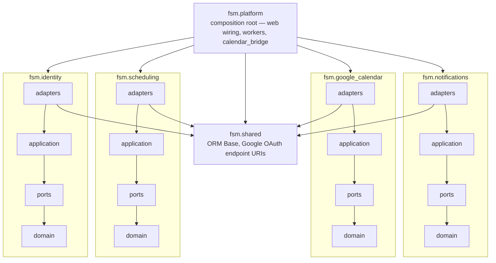

# Field Service Management

A platform for service agencies (think elevator or appliance maintenance) that runs the whole job
lifecycle from a single source of truth. It is built **slice by slice**, each module getting its own
design → plan → implementation cycle.

**Contents:** [Status](#status) · [Vision](#the-full-vision) · [Overview](#overview) · [Getting started](#getting-started) · [Scripts](#scripts) · [Testing](#testing) · [Architecture](#architecture) · [Authentication & live communication](#authentication--live-communication) · [Database schema](#database-schema) · [License](#license)

## Status

**Slice 1 — Scheduling — is feature-complete:** it delivers the calendar-and-booking core of the
vision below. Google OIDC sign-in with roles, one-click technician calendar connect, customer
self-booking with a database-enforced no-double-booking guarantee, two-way Google Calendar sync
(outbound projection + inbound reconcile), central holiday exclusions, per-technician working hours
and time off, and in-app + email/.ics notifications (`.ics` = a calendar-invite attachment the
recipient can add to their own calendar). Google is required configuration — it is the only sign-in
path, so its environment variables must be set and every booking and scheduling action needs a
signed-in session. Email and holiday integrations are driven by environment variables and degrade
gracefully when unset.

## The full vision

Five pieces, of which Slice 1 above is the scheduling core:

- **Back office** — customers, sites, and contacts; an asset catalog with per-device fault history; a
  scheduling dashboard tracking every call open → assigned → en route → in progress → done.
- **Technician field app** — daily route and navigation, check-in/out with time logging, digital
  service reports (checklists, notes, before/after photos) and an on-screen signature that
  auto-generates a signed PDF — all usable offline and syncing when the network returns.
- **Customer chat app** — a WhatsApp-style bot to open a call (pick the asset, describe the problem,
  attach a photo), self-service status, live "technician on the way" alerts, and signed-report download.
- **Backend** — role-based access (admin, dispatch, technician, customer), push/SMS/email
  notifications, PDF generation, and advanced search across customers, technicians, and assets.
- **Integrations & integrity** — two-way calendar sync, maps/navigation, cloud document storage, plus
  GPS verification, mandatory photo evidence, full audit trail, and parts/inventory control.

**Full product scope** is captured in the [vision document](https://docs.google.com/document/d/1bX7L_CL6hBIfpJVCkpRFYk6hIZ7OxD7dSugnPWCKLsY/edit),
from which the five pieces above are summarized.

## Overview

- **Backend** (`backend/`): Python 3.12+, FastAPI, SQLAlchemy 2.x + PostgreSQL, Alembic.
- **Frontend** (`frontend/`): a modular React (Vite + TypeScript) app.
- **Source of truth** is the Postgres database; external systems (Google Calendar) are downstream
  projections reached through ports, never imported by the core.

## Getting started

Prerequisites: **Python ≥3.12**, **Docker**, and **Node.js 22+ with npm**.

### 1. Configuration (`backend/.env`)

```bash
./scripts/init-env.sh   # writes backend/.env from backend/.env.example, generating FSM_TOKEN_KEY + SESSION_SECRET
```

Configuring the **Google Cloud Console** OAuth client is mandatory. Google is the only sign-in path,
and every booking and scheduling action requires a signed-in session, so the app does nothing useful
until it is set. `init-env.sh` handles the rest of the baseline — `DATABASE_URL`/`APP_ENV` default to
the bundled Docker Postgres and the two local secrets are generated for you. Holidays and email are
the only features that stay disabled, without error, when left unset.

Each key — what it does, when it is required, and how to obtain it — is documented inline in
[`backend/.env.example`](backend/.env.example), which also contains the Google Cloud Console setup
steps. Refer to it there rather than duplicating the list here.

### 2. Runtime

One launcher, **one** `backend/.env`, two run modes that reach the roles at the **same URLs**, each
completing Google sign-in. Docker is the default (a closer-to-production stack); `--host` runs the
roles as local uvicorn processes for fast boot and debugger attach. Either way PostgreSQL and Redis
run in Docker.

```bash
# DOCKER mode (default): roles run as containers; nginx publishes one localhost port per role
./scripts/start.sh                   # all roles: db + redis + migrations + backends + nginx
./scripts/start.sh technician        # one role (alias tec) -> http://localhost:8001

# HOST mode (--host): each role is a local uvicorn process on the same ports
./scripts/start.sh --host                # all roles            -> :8001 / :8002 / :8003
./scripts/start.sh technician --host     # one role (alias tec) -> http://localhost:8001
```

The launcher is idempotent and requires `backend/.env` (step 1) — it aborts with instructions if
that file is missing. Docker mode builds the backend image and brings the roles up as compose
services; `--host` provisions the virtualenv, builds the frontend, and runs one uvicorn per role.
Each mode starts PostgreSQL and Redis via Docker and applies migrations first. Edit `backend/.env`
and re-run to pick up changes. In either mode every role serves its React UI at `/`, API docs at
`/docs`, and `/health` + `/ready` for liveness and readiness. Bring the stack down or tail logs with
`./scripts/docker-helper.sh --stop` / `--logs`.

#### Open a UI in your browser

Each role is reached on its own `localhost` port — the same in either mode. In Docker mode nginx
serves the SPA and proxies the API per port; in host mode the uvicorn process serves the SPA and API
directly.

| App | URL |
|---|---|
| Technician | http://localhost:8001 |
| Customer | http://localhost:8002 |
| Back office | http://localhost:8003 |

## Scripts

All live in `scripts/`; run with `-h`/`--help` for full usage.

| Script | Purpose |
|---|---|
| `init-env.sh` | Bootstrap `backend/.env` on a fresh checkout. |
| `generate-secret.sh` | Generate one application secret; used by `init-env.sh`. |
| `start.sh` | Run the app. |
| `docker-helper.sh` | Operate the running Docker stack. |
| `sql-helper.sh` | Open psql against the database. |
| `test.sh` | Run the test suite — see [Testing](#testing). |

## Testing

Run the whole suite — backend (unit, integration, API, contract, and architecture tests) plus the
frontend gates (typecheck, lint, vitest unit/component tests, build):

```bash
./scripts/test.sh            # everything; pass `backend` or `frontend` to scope it
```

Backend integration tests use ephemeral PostgreSQL via testcontainers, so Docker must be running. See
[docs/testing.md](docs/testing.md) for the test taxonomy.

## Architecture

A **modular monolith** organized as bounded contexts under a single `fsm` package, following
ports-and-adapters (hexagonal) design:

| Package | Responsibility |
|---|---|
| `identity` | Google OIDC sign-in, users, roles |
| `scheduling` | service calls, appointments, availability, lifecycle — the core domain (no external I/O) |
| `google_calendar` | Google Calendar connections and the raw API client behind the `GoogleCalendarClient` port |
| `notifications` | in-app feed + email/.ics behind `NotificationPort` |
| `platform` | composition root: configuration, database, web wiring, background workers, and the conformance bridges that implement one context's ports in terms of another (e.g. `calendar_bridge` implements scheduling's `CalendarPort` over the google_calendar context's client) |
| `shared` | shared kernel: the declarative ORM `Base` and Google OAuth endpoint URIs — the only package a context may import from outside itself |

### Import rules

Arrows read **may import**. There are no arrows between contexts — none may import another — and
none from a context up to `platform`:



The three inner layers (`application`, `ports`, `domain`) use only their own context and the
standard library — `adapters` is the sole layer that may import `shared` and infrastructure
libraries (SQLAlchemy, Google clients).

Contexts therefore integrate without knowing each other. The consumer declares an interface in
its own `ports` package (`scheduling.ports.CalendarPort`), and `platform` builds and injects the
implementation (`platform.calendar_bridge.GoogleCalendarAdapter`, written against the
google_calendar context's `GoogleCalendarClient` port). Application code receives its dependencies as constructor
arguments and names only these interfaces, never concrete adapters.

These rules are **enforced in CI**: the import-linter contracts in `backend/pyproject.toml`
(`[tool.importlinter]`, run as `lint-imports` or via `backend/tests/test_architecture.py`) fail
the build on any import outside this shape — including one reached transitively through another
module.

## Authentication & live communication

Google OIDC is the only sign-in path, and every booking and scheduling route requires a signed-in
session; the session is a signed cookie and a role is assigned from the role of the process that
completes the sign-in (the per-role edge), never from client input. Once signed in, the frontend drives
the system with REST calls and receives live updates over a single Server-Sent Events stream, fanned
out across the per-role processes by Redis pub/sub.
[docs/auth-and-communication.md](docs/auth-and-communication.md) traces the main flows end-to-end —
Google sign-in, technician calendar-connect, and the back office approving a technician (dashboard open
and closed) — with the CSRF, PKCE, and token-encryption properties they rely on and what scaling a role
to several replicas requires. Per-key configuration lives inline in
[`backend/.env.example`](backend/.env.example).

## Database schema

PostgreSQL is the source of truth; Google Calendar is a downstream projection. The entity-relationship
diagram and the integrity guarantees (database-enforced no-double-booking, the transactional
calendar outbox, the append-only appointment audit) are in [docs/data.md](docs/data.md).

## License

Released under the MIT License. See [LICENSE](LICENSE).
