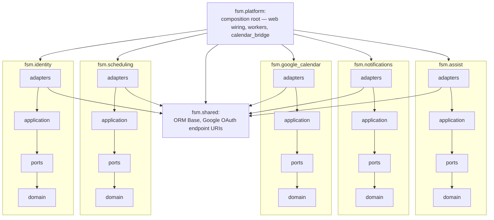

# Architecture

Detail behind the [root README's summary](../README.md#architecture): what each package owns, the
exact import rules, how contexts integrate without knowing each other, how CI enforces all of it,
and how authentication and live communication work at runtime.

## Bounded contexts

| Package | Responsibility |
|---|---|
| `assist` | knowledge base and AI triage chat for the customer channel (LangChain/pgvector behind ports) |
| `identity` | Google OIDC sign-in, users, roles |
| `scheduling` | service calls, appointments, availability, lifecycle — the core domain (no external I/O) |
| `google_calendar` | Google Calendar connections and the raw API client behind the `GoogleCalendarClient` port |
| `notifications` | in-app feed for both parties + technician email behind `NotificationPort` |
| `platform` | composition root: configuration, database, web wiring, background workers, and the conformance bridges that implement one context's ports in terms of another (e.g. `calendar_bridge` implements scheduling's `CalendarPort` over the google_calendar context's client) |
| `shared` | shared kernel: the declarative ORM `Base`, Google OAuth endpoint URIs, and product identity constants (the brand name) — the only package a context may import from outside itself |

## Import rules

Arrows read **may import**. There are no arrows between contexts — none may import another — and
none from a context up to `platform`:

The three inner layers (`application`, `ports`, `domain`) use only their own context, the standard
library, and `shared.constants` (the product brand). Only `adapters` may import the rest of `shared`
(the ORM `Base`, OAuth URIs) and infrastructure libraries (SQLAlchemy, Google clients).

## How contexts integrate

Contexts integrate without knowing each other. The consumer declares an interface in its own
`ports` package (`scheduling.ports.CalendarPort`), and `platform` builds and injects the
implementation (`platform.calendar_bridge.GoogleCalendarAdapter`, written against the
google_calendar context's `GoogleCalendarClient` port). Application code receives its dependencies
as constructor arguments and names only these interfaces, never concrete adapters.

## Enforcement in CI

The import rules are executable: the import-linter contracts in `backend/pyproject.toml`
(`[tool.importlinter]`, run as `lint-imports` or via `backend/tests/test_architecture.py`) fail
the build on any import outside this shape — including one reached transitively through another
module.

## Authentication & live communication

Google OIDC is the only sign-in path, and every booking and scheduling route requires a signed-in
session; the session is a signed cookie and a role is assigned from the role of the process that
completes the sign-in (the per-role edge), never from client input. Once signed in, the frontend
drives the system with REST calls and receives live updates over a single Server-Sent Events
stream, fanned out across the per-role processes by Redis pub/sub.
[auth-and-communication.md](auth-and-communication.md) traces the main flows end-to-end — Google
sign-in, technician calendar-connect, and the back office approving a technician (dashboard open
and closed) — with the CSRF, PKCE, and token-encryption properties they rely on and what scaling a
role to several replicas requires. Per-key configuration lives inline in
[`backend/.env.example`](../backend/.env.example).
