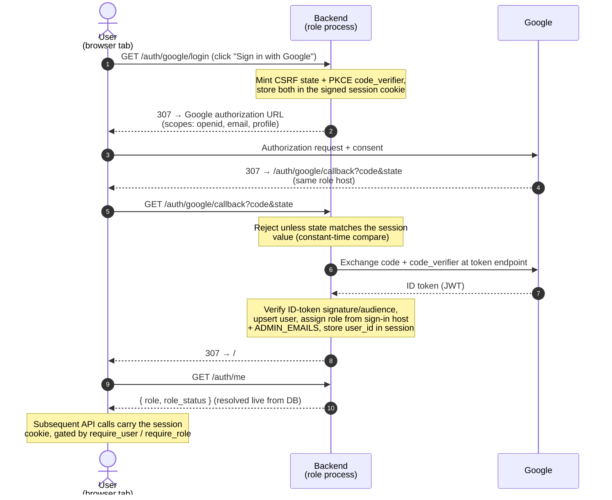
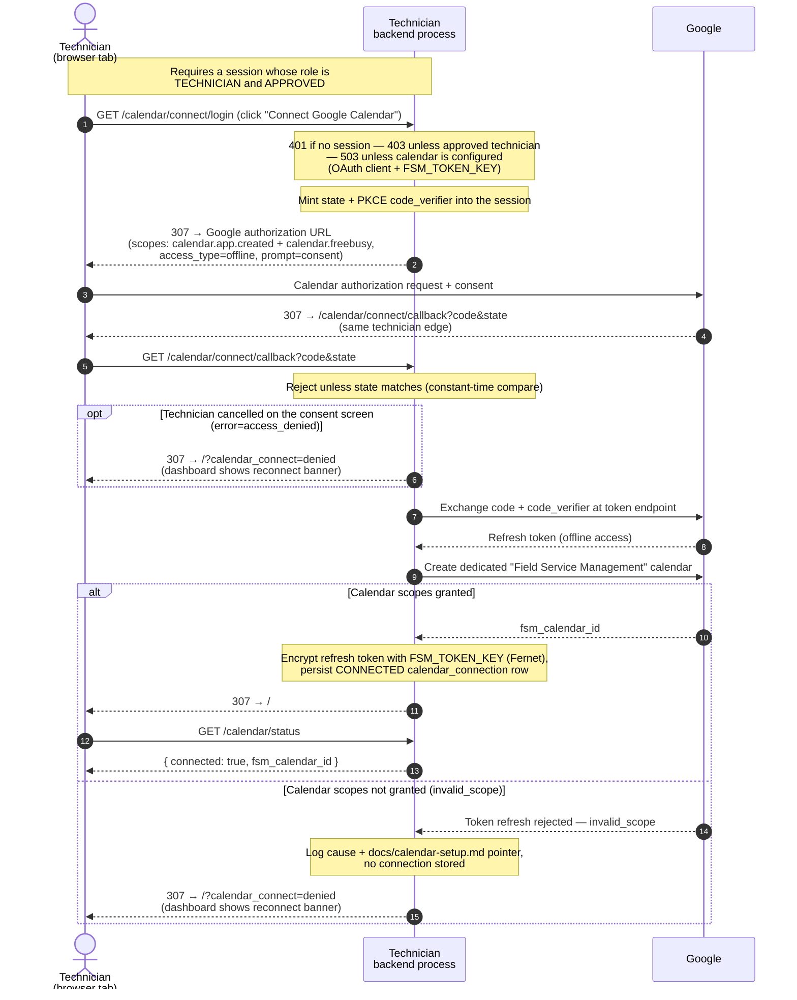
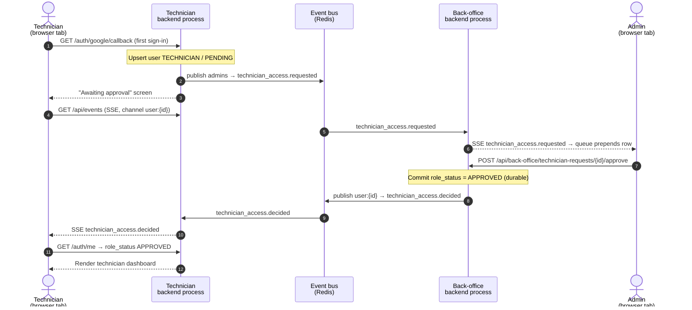
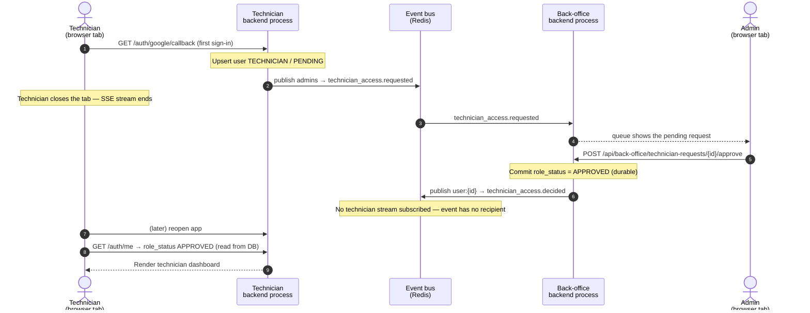

# Authentication & live communication

Google OIDC<sup>(1)</sup> is the only sign-in path, so there is no password store to protect, and every
booking and scheduling route requires a signed-in session, so there is no anonymous access. Once signed in, the
frontend drives the system with ordinary REST<sup>(2)</sup> calls and receives live updates over a single
Server-Sent Events<sup>(3)</sup> stream; a Redis pub/sub<sup>(4)</sup> bus carries those events
between the per-role processes, so a push raised in one process reaches a stream held by another.

This page traces the app's main flows end-to-end — how the browser tabs, the per-role backends, Google,
and the event bus talk to each other — without diving into the code. Terms that aren't obvious are
clarified just enough to follow the flow in the [Glossary](#glossary); this is a map of *this app*, not
a primer on REST, SSE, or OAuth.

**Contents:** [Reading the diagrams](#reading-the-diagrams) · [Glossary](#glossary) · [Flows](#flows) · [Running a role across several replicas](#running-a-role-across-several-replicas) · [Security guarantees](#security-guarantees) · [Token and session lifetimes](#token-and-session-lifetimes)

## Reading the diagrams

Every `GET`/`POST` arrow is a browser tab talking to its own backend process (or that backend calling
Google); backends never talk to each other directly, only through the bus.

The two arrow styles separate what *starts* an exchange from what comes *back*. The style encodes
direction, not transport — the label names the transport.

| Arrow | Style | Meaning |
| --- | --- | --- |
| `->>` | solid | A message the sender initiates: an HTTP request from the browser, a backend calling Google, or a `publish` onto the bus. |
| `-->>` | dashed | Something sent back to the recipient — an HTTP response that renders a screen or returns data, or an SSE push. The label disambiguates: arrows tagged `SSE` are stream pushes; the rest are ordinary HTTP responses. |

Reading top to bottom shows just one possible ordering, chosen for readability — a higher arrow does not
necessarily happen before a lower one. Two steps are ordered only when they share a participant or have a
real causal dependency (a response to its request, or a delivery of a publish). Steps on independent
branches — such as the bus delivering a request to the back office versus the technician opening their
SSE stream — can happen in either order.

### Glossary

Minimal, app-specific clarifications — just enough to read the flows, not full definitions.

| Ref | Term | Meaning in this app |
| --- | --- | --- |
| (1) | OIDC — OpenID Connect | Google's sign-in: it authenticates the user and hands back a signed token asserting who they are. |
| (2) | REST | The ordinary request/response HTTP calls the frontend uses for reads and writes. |
| (3) | SSE — Server-Sent Events | The one-way stream (one per browser tab, at `GET /api/events`) the backend uses to push live updates. Each connection receives only its owner's channel — `user:{id}`, plus `admins` for an admin. |
| (4) | pub/sub | The Redis channel mechanism that carries events between the per-role processes, so a push from one process reaches a tab connected to another. |
| (5) | CSRF — Cross-Site Request Forgery | The attack the random `state` on the OAuth callback blocks; the callback rejects any mismatch. |
| (6) | PKCE — Proof Key for Code Exchange | A secret `code_verifier` minted at login and presented when redeeming the authorization code, so a stolen code is useless to anyone else. |
| (7) | funnel | The host→role mapping: each role runs behind its own host, and that host fixes which role (`FSM_ROLE`) a completed sign-in grants — never a client choice. |
| (8) | JWT — JSON Web Token | The format of Google's ID token; its claims are verified offline against Google's public keys, then it is discarded. |
| (9) | Fernet | The symmetric encryption used to store the technician's Google refresh token under `FSM_TOKEN_KEY`. |

## Flows

Sign-in is the shared entry point for every role; the rest trace the technician's onboarding and the
back office's approval of it.

### Sign in with Google — all roles

Each role runs as its own process behind its own host (`localhost:8001` technician, `:8002` customer,
`:8003` back office). The process that starts a sign-in also finishes it: the callback URL is derived
from the host the request arrived on, so a flow begun on `:8003` returns to `:8003`. The session is a
signed cookie (`SESSION_SECRET`); the server keeps no session table.



### Connect Google Calendar — technician

Connecting a technician's Google Calendar is a second OAuth consent, separate from sign-in: it shares
the same OAuth client but requests only the two narrow calendar scopes — `calendar.app.created` and
`calendar.freebusy` — and uses its own redirect URI (`/calendar/connect/callback`). Those scopes are
what make the integration private by construction: the system can create and manage its own "Field
Service Management" calendar and read opaque busy/free intervals, but the broad `calendar` scope is
never requested, so the technician's other calendars and private event details stay invisible. It is
gated on an **approved** technician session, not on authentication alone: connecting a calendar is
what puts its owner into customer-facing pooled availability, so a signed-in technician still waiting
on (or refused by) the back office is rejected with 403. The refresh token Google returns is
encrypted at rest with `FSM_TOKEN_KEY` before it is stored, so the database never holds a usable
token in plaintext.

If Google returns a grant without those scopes — the technician skipped the calendar permission on the
consent screen, or the OAuth client is not configured for them — the first Google API call fails; the
callback logs the cause, stores no connection, and sends the technician back to the app flagged
(`/?calendar_connect=denied`), where the dashboard shows a dismissible "reconnect and allow calendar
access" banner. Cancelling on the consent screen (`error=access_denied`) takes the same path. See
[calendar-setup.md](calendar-setup.md) for the operator setup (enabling the Calendar API, registering
the scopes, test users) and the revoke-and-reconnect steps required after any scope change.



### Technician approval — dashboard live

A technician onboarding requests access on first sign-in, and the back office approves it once. When
the technician is sitting on the "Awaiting approval" screen with its SSE stream open, the decision
reaches them in real time and the view flips to the dashboard with no refresh.



### Technician approval — dashboard not live

If the technician has closed the tab, no stream is subscribed to their `user:{id}` channel, so the
`technician_access.decided` event is published but reaches no one. Correctness does not depend on it:
the decision is committed to `app_user.role_status`, and the next time the technician loads the app,
`GET /auth/me` resolves that status live from the database and renders the dashboard directly. SSE is
an accelerator for the open-tab case, never the system of record.



The mirror image is symmetric: a `reject` decision sets `role_status = REJECTED` the same way, and a
pending technician who signs out before approval triggers `technician_access.withdrawn`, removing their
row from the live back-office queue.

## Running a role across several replicas

The flows show one process per role, reached in development on a fixed port (`:8001` technician, `:8002`
customer, `:8003` back office). That port is only each role's local **edge** — not a slot the role
occupies, and not something replicas share. The role a sign-in grants comes from the process's own
`FSM_ROLE` config (its funnel<sup>(7)</sup>; `_sign_in_host` maps `FSM_ROLE` → role), never from the
port or host. So scaling a role horizontally just means running several processes that all set the same
`FSM_ROLE`: each is an independent process bound to its own address, and a load balancer fronts them
under that role's public host, spreading requests across them. Replicas never contend for a port, and
replication never changes which role a sign-in grants.

For example, one back office, two technician, and five customer processes is how
[`docker-compose.yml`](../docker-compose.yml) is wired — the role is the only difference between the
backend services, and only nginx holds a port (trimmed here to the essentials):

```yaml
# One built image; role services differ only by FSM_ROLE, so a role's replicas are interchangeable.
x-fsm: &fsm
  image: fsm-backend:local
  env_file: [./backend/.env]          # shared SESSION_SECRET → any replica accepts any session cookie
  environment: &env
    REDIS_URL: redis://redis:6379/0   # carries SSE events across replicas

services:
  nginx:                                # the only service that publishes host ports
    image: fsm-nginx:local
    ports: ["8001:8001", "8002:8002", "8003:8003"]

  backoffice: { <<: *fsm, environment: { <<: *env, FSM_ROLE: backoffice }, deploy: { replicas: 1 } }
  technician: { <<: *fsm, environment: { <<: *env, FSM_ROLE: technician }, deploy: { replicas: 2 } }
  customer:   { <<: *fsm, environment: { <<: *env, FSM_ROLE: customer   }, deploy: { replicas: 5 } }
```

The role services publish no host port, so nginx reaches them on the Docker network instead. It
does not discover them — the mapping is declared: each role is an `upstream` naming the Compose service
and the container port its uvicorn listens on (see [`nginx/default.conf`](../nginx/default.conf)):

```nginx
upstream technician_backend { server technician:8001; }   # 'technician' resolves to both replicas
upstream customer_backend   { server customer:8002; }     # 'customer' resolves to all five
upstream backoffice_backend { server backoffice:8003; }
```

Compose's built-in DNS resolves a service name to the IPs of all its replicas, so one `server
technician:8001` line spreads requests across every technician process.

The replicas all listen on the same port number without conflict because a port belongs to a network
namespace, not to the machine. Each container has its own namespace and IP, so the two technicians bind
`8001` on `172.18.0.5:8001` and `172.18.0.6:8001` — distinct addresses, like two separate servers both
using port 8001. A bind conflict needs the *same* port on the *same* namespace, which is why running the
roles as bare processes on one host instead requires distinct ports (`8001/8002/8003`), and why no role
service publishes a host port — only `nginx` does.

Two infrastructure conditions make a multi-replica role safe:

- **Share `SESSION_SECRET` across every replica.** The session is a signed cookie with no server-side
  store, and the OAuth `state` and PKCE `code_verifier` ride inside it. A login that begins on one
  replica and whose callback lands on another completes correctly as long as both verify with the same
  secret — so **sticky sessions are not required**, even for the OAuth handshake.
- **Set `REDIS_URL`.** With more than one process the in-process event bus cannot reach across
  replicas; the Redis bus carries each SSE event to subscribers on every replica, so a client
  connected to one instance still receives events published by another.

One constraint is not about role funnels: the background calendar workers (`FSM_DISPATCH_ENABLED` /
`FSM_SYNC_ENABLED`) must be owned by exactly one process. When the back office runs as several replicas,
enable the workers on one and leave them off on the rest, or they will each drain the shared calendar
outbox and poll Google redundantly. Customer and technician replicas never touch those flags. What
these workers do — the outbound projection dispatcher and the inbound reconciliation poller — is
traced in [docs/data.md](data.md#calendar-sync).

Per-key configuration — what each secret does and how to obtain the Google credentials — lives inline
in [`backend/.env.example`](../backend/.env.example).

## Security guarantees

- **CSRF<sup>(5)</sup> on the OAuth handshake.** `/auth/google/login` mints a random `state` into the
  session and the callback rejects any mismatch with a constant-time compare. A PKCE<sup>(6)</sup>
  `code_verifier` rides the same session so the separately-built callback flow can complete the exchange.
- **Sessions are signed, not stored.** The cookie carries only `user_id`; `SESSION_SECRET` signs it.
  Blank `SESSION_SECRET` means no session middleware is mounted and every sign-in fails.
- **Role and status are read live.** The session holds only `user_id`; `/auth/me` re-resolves `role`
  and `role_status` from the database on every call, so a just-approved technician advances without
  re-authenticating, and a revoked one loses access on their next request.
- **Roles come from the process, not the client.** The role is assigned from the `FSM_ROLE` of the
  process that completes the callback — each role runs as its own process behind its own edge host. The
  back-office role additionally requires the email to be in `ADMIN_EMAILS`; other edges fall back to the
  customer/technician funnels. There is no client-supplied role.
- **Refresh tokens are encrypted at rest.** A technician's stored Google refresh token is encrypted
  with `FSM_TOKEN_KEY`; rotating that key makes existing calendar connections undecryptable.
- **Live streams carry only the caller's own channels.** The SSE stream subscribes a connection to
  `user:{id}`, plus `admins` for an approved administrator, and to nothing else — so a client cannot
  listen in on back-office events by asking.

## Token and session lifetimes

Three different credentials are in play, each with its own lifetime. None of them needs an expiry knob
in the configuration, which is why none appears in `.env.example` — the absence is deliberate, not an
oversight.

- **The Google ID token (JWT<sup>(8)</sup>) is used once and discarded.** At `/auth/google/callback`
  the token's signature, audience, and expiry are checked in that single moment (with a few seconds of
  clock-skew leeway), the email is extracted, and the token is thrown away — it is never stored. Its
  validity window is therefore Google's concern, not a setting here.
- **The session cookie carries the user across requests, with a 14-day default lifetime.** It is a
  signed cookie holding only `user_id`, backed by no server-side record. The session middleware is
  mounted without an explicit `max_age`, so it inherits Starlette's default lifetime of 14 days; past
  that the signature is treated as stale and the user signs in again. Because `role` and `role_status`
  are not in the cookie but re-read from the database on every `/auth/me`, even a days-old cookie still
  reflects an account approved or revoked since it was issued.
- **The Google Calendar refresh token is stored; the access token it yields is not.** The refresh token
  is the only credential persisted at rest, encrypted with `FSM_TOKEN_KEY` (Fernet<sup>(9)</sup>). It
  has no timer — it stays valid until the technician revokes access, Google invalidates it, or the
  encryption key is rotated. What does expire is the short-lived access token derived from it, and that
  is never stored: the client factory builds Google credentials with no access token and only the
  refresh token, so the google-auth library exchanges the refresh token for a fresh access token on
  first use and silently re-refreshes it whenever it lapses (roughly hourly). The application never
  schedules or sees that refresh, which is why there is no access-token column and no expiry to tune.
