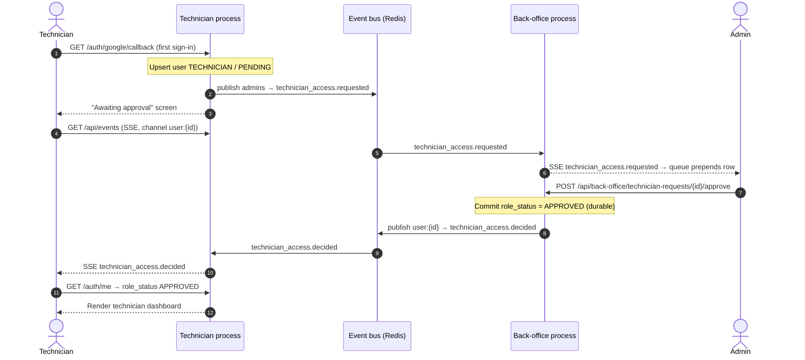
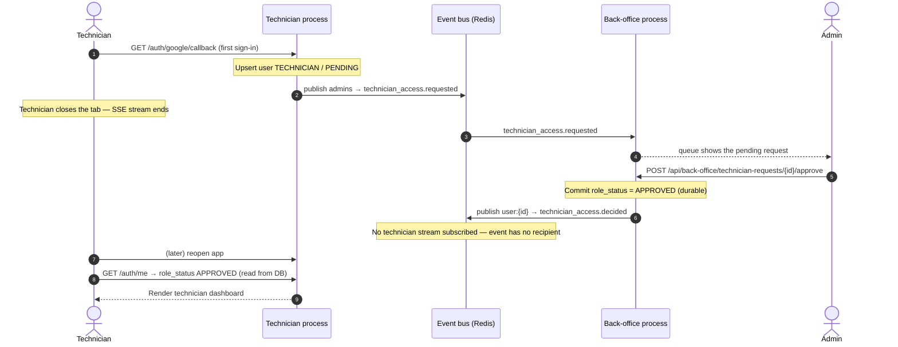

# Communication (REST & SSE)

The frontend drives the system with ordinary REST calls and receives live updates over a single
Server-Sent Events stream. This page traces the most prominent live interaction — a technician
onboarding and the back office approving them — to show how the two fit together, and what happens
when the technician's dashboard is not open at the moment of the decision.

## The moving parts

- **REST.** Sign-in completes at `GET /auth/google/callback`; the back-office queue is read at
  `GET /api/back-office/technician-requests` and a decision is posted to
  `POST /api/back-office/technician-requests/{id}/approve` (or `/reject`). Identity is re-resolved at
  `GET /auth/me`.
- **SSE.** Each browser tab opens one stream at `GET /api/events`. The server subscribes the
  connection only to the channels its caller is entitled to: `user:{id}` for everyone, plus the
  `admins` channel for an approved administrator. Events are framed as `event: <type>` / `data:
  <json>`.
- **The bus.** In the container deployment each role is a separate process, so the event bus is
  Redis pub/sub (`REDIS_URL`) — that is what lets a decision made in the back-office process reach a
  stream held open by the technician process. In single-process host mode the same interface is an
  in-process fan-out.
- **Events.** Onboarding publishes `technician_access.requested` (and `technician_access.withdrawn`)
  to `admins`; a decision publishes `technician_access.decided` to the requester's `user:{id}`.

## When the technician's dashboard is live

The technician is sitting on the "Awaiting approval" screen with its SSE stream open, so the decision
reaches them in real time and the view flips to the dashboard with no refresh.

## When the technician's dashboard is not live

If the technician has closed the tab, no stream is subscribed to their `user:{id}` channel, so the
`technician_access.decided` event is published but reaches no one. Correctness does not depend on it:
the decision is committed to `app_user.role_status`, and the next time the technician loads the app,
`GET /auth/me` resolves that status live from the database and renders the dashboard directly. SSE is
an accelerator for the open-tab case, never the system of record.

The mirror image is symmetric: a `reject` decision sets `role_status = REJECTED` the same way, and a
pending technician who signs out before approval triggers `technician_access.withdrawn`, removing
their row from the live back-office queue.
