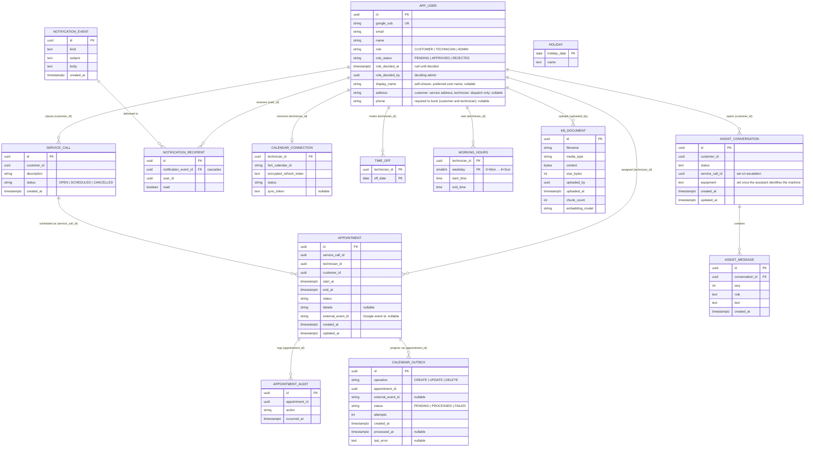

# Database schema

PostgreSQL is the system's source of truth; Google Calendar is a downstream projection, never a
store of record. The schema is owned by the bounded contexts(1) — `identity`, `scheduling`,
`google_calendar`, `notifications`, and `assist` — and lives in each context's `adapters/orm.py`, with
Alembic(2) migrations under `backend/alembic/versions`.

There is one identity table, `app_user`: technician, customer, and administrator are roles on that
row, not separate entities. Cross-context references (a technician, a customer) are plain `UUID`(3)
columns pointing at `app_user.id`; they are application-level relationships, not database foreign
keys, so each context can be migrated and reasoned about independently. The relationships drawn below
are those logical links.

`HOLIDAY` stands alone — a per-date cache of public holidays excluded from availability, with no
link to any other entity.

One appointment change notifies both parties with the same wording, so the notification feed splits
content from delivery: `NOTIFICATION_EVENT` holds the subject and body once, and one
`NOTIFICATION_RECIPIENT` row per user carries that user's own `read` flag. Recipient rows cascade
with their event, and `(notification_event_id, user_id)` is unique, so one event reaches a given user
exactly once.

`KB_DOCUMENT` stores uploaded knowledge-base source documents; the vector index is derived from these
rows so re-chunking or embedding-model changes rebuild from stored bytes without re-uploading.
`uploaded_by` is a plain user id (no cross-context FK, per the file's stated rule).

A triage conversation ends exactly once — solved, escalated, or abandoned — and only an escalated
one carries a `service_call_id`. That column is a plain id, not a foreign key, because the service
call belongs to the scheduling context. Messages cascade with their conversation; `seq` is what
orders them, so replaying a chat does not depend on timestamp resolution. `equipment` holds the
assistant's current identification of the machine, which the knowledge-base query is built from;
each identification overwrites the last, so the column carries the conclusion and not the
corrections that led to it.

## Integrity guarantees worth knowing

- **No double-booking.** A GiST exclusion constraint(4) on `appointment` rejects any two non-cancelled
  appointments for the same technician whose `[start_at, end_at)` windows overlap — the
  no-double-booking promise is enforced in the database, not just in application code.
- **One open triage conversation per customer.** A partial unique index on
  `assist_conversation (customer_id) WHERE status = 'ACTIVE'` rejects a second open conversation.
  Starting one is a read-then-insert, so two concurrent requests — a double-submitted button, two
  tabs — both pass the read; the database rejects the loser, and the assist adapter translates that
  into a domain error the triage service handles by joining the conversation that won. A customer's
  history therefore cannot split into two threads.
- **Turn order is stored, not inferred.** `assist_message (conversation_id, seq)` is unique, so two
  turns racing for the same position fail loudly instead of leaving replay order to chance.
- **Calendar projection is transactional.** Confirmed appointment changes enqueue a `calendar_outbox`(5)
  row in the same transaction; a background dispatcher drains it onto Google with bounded retries
  (`PENDING → PROCESSED`, or `→ FAILED` after repeated failures), so a calendar outage never loses a
  booking.
- **Appointment history is append-only.** Every lifecycle transition writes an `appointment_audit`
  row in the appointment's own transaction, keeping the log consistent with entity state.
- **One connection per technician.** `calendar_connection` keys on `technician_id` alone;
  `working_hours` and `time_off` use composite keys so a technician has at most one window per
  weekday and one row per day off.

## Calendar sync

Two background workers keep Google Calendar aligned with the database. Each runs on exactly one
process — the back office — and is gated by its own flag; running either on several replicas would
drain the outbox and poll Google redundantly. Both directions treat PostgreSQL as the merge
authority: Google is a projection, so any conflict resolves in the database's favour.

**Outbound projection (database → Google).** A confirmed appointment change (create, reschedule,
cancel) enqueues a `calendar_outbox` row in the same transaction as the appointment write, so a
calendar outage can never lose a booking. `CalendarProjectionDispatcher` — run by `dispatcher_runner`
under `FSM_DISPATCH_ENABLED`, every `FSM_DISPATCH_INTERVAL_SECONDS` (default 5s) — claims one
`PENDING` entry at a time with `SELECT … FOR UPDATE SKIP LOCKED`, performs the Google operation,
writes back the `external_event_id`, and commits per entry. Each event carries a deterministic
iCalUID, so a retry after a crash re-finds the existing event (Google answers a duplicate insert with
HTTP 409) rather than creating a second one. Transient failures keep the entry `PENDING` until
`MAX_ATTEMPTS`, then dead-letter it to `FAILED`.

**Inbound reconciliation (Google → database).** `sync_runner`, under `FSM_SYNC_ENABLED` every
`FSM_SYNC_INTERVAL_SECONDS` (default 30s), polls each technician's calendar using the stored
`sync_token` for incremental changes. `calendar_bridge/inbound_sync` maps each raw event to an
`InboundEventChange` and discards events whose iCalUID is not FSM-owned. `reconciliation_service` then
applies the change under last-write-wins arbitration — the Google event's last-modified time against
the appointment's `updated_at`: a stale edit is dropped, a customer decline or technician cancel
updates the row, and an edit that conflicts with the booking policy loses to the database and enqueues
a re-projection `UPDATE` back onto the outbox. Each committed change publishes an event so the
affected participants' open views refresh live.

## Glossary

In the diagram, `PK` marks a primary key and `UK` a unique key.

| Ref | Term | Meaning |
| --- | --- | --- |
| (1) | bounded context | A self-contained slice of the domain (`identity`, `scheduling`, `google_calendar`, `notifications`, `assist`) that owns its own tables and is migrated and reasoned about independently of the others. |
| (2) | Alembic | The SQLAlchemy migration tool; each context's schema changes are versioned as migration scripts under `backend/alembic/versions`. |
| (3) | UUID — Universally Unique Identifier | A 128-bit identifier used as every table's key, so rows can be referenced across contexts without a shared database sequence. |
| (4) | GiST exclusion constraint | A PostgreSQL constraint backed by a Generalized Search Tree index that rejects rows whose ranges overlap; here it forbids two non-cancelled appointments for one technician from overlapping in time. |
| (5) | calendar outbox | A table that records pending Google Calendar operations in the same transaction as the appointment change (the transactional-outbox pattern), drained later by a background dispatcher so a calendar outage never loses a booking. |
