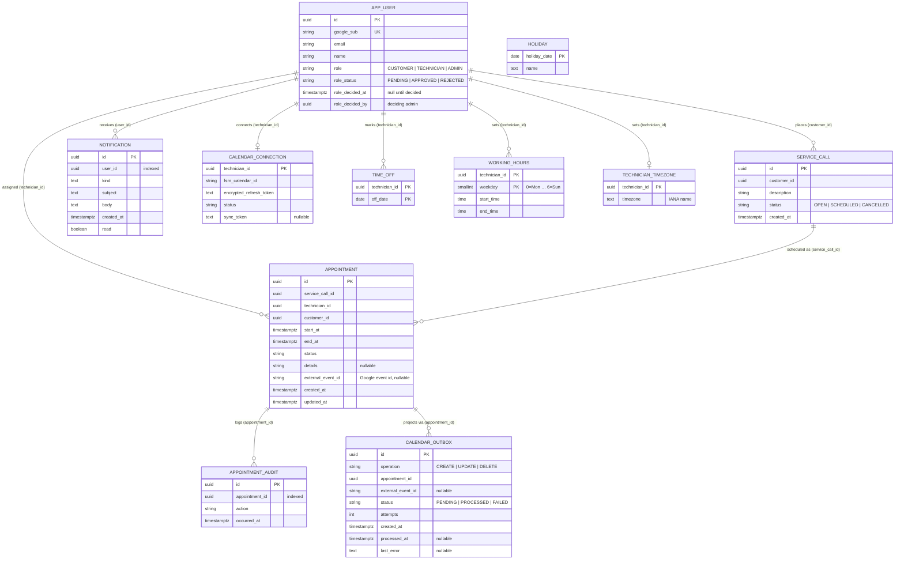

# Database schema

PostgreSQL is the system's source of truth; Google Calendar is a downstream projection, never a
store of record. The schema is owned by the bounded contexts(1) — `identity`, `scheduling`,
`calendar`, and `notifications` — and lives in each context's `adapters/orm.py`, with Alembic(2)
migrations under `backend/migrations/versions`.

There is one identity table, `app_user`: technician, customer, and administrator are roles on that
row, not separate entities. Cross-context references (a technician, a customer) are plain `UUID`(3)
columns pointing at `app_user.id`; they are application-level relationships, not database foreign
keys, so each context can be migrated and reasoned about independently. The relationships drawn below
are those logical links.

`HOLIDAY` stands alone — a per-date cache of public holidays excluded from availability, with no
link to any other entity.

## Integrity guarantees worth knowing

- **No double-booking.** A GiST exclusion constraint(4) on `appointment` rejects any two non-cancelled
  appointments for the same technician whose `[start_at, end_at)` windows overlap — the
  no-double-booking promise is enforced in the database, not just in application code.
- **Calendar projection is transactional.** Confirmed appointment changes enqueue a `calendar_outbox`(5)
  row in the same transaction; a background dispatcher drains it onto Google with bounded retries
  (`PENDING → PROCESSED`, or `→ FAILED` after repeated failures), so a calendar outage never loses a
  booking.
- **Appointment history is append-only.** Every lifecycle transition writes an `appointment_audit`
  row in the appointment's own transaction, keeping the log consistent with entity state.
- **One connection / window per technician.** `calendar_connection` and `technician_timezone` key on
  `technician_id` alone; `working_hours` and `time_off` use composite keys so a technician has at
  most one window per weekday and one row per day off.

## Glossary

In the diagram, `PK` marks a primary key, `UK` a unique key, and an `IANA name` is a timezone
identifier from the IANA database (for example `Europe/Berlin`).

| Ref | Term | Meaning |
| --- | --- | --- |
| (1) | bounded context | A self-contained slice of the domain (`identity`, `scheduling`, `calendar`, `notifications`) that owns its own tables and is migrated and reasoned about independently of the others. |
| (2) | Alembic | The SQLAlchemy migration tool; each context's schema changes are versioned as migration scripts under `backend/migrations/versions`. |
| (3) | UUID — Universally Unique Identifier | A 128-bit identifier used as every table's key, so rows can be referenced across contexts without a shared database sequence. |
| (4) | GiST exclusion constraint | A PostgreSQL constraint backed by a Generalized Search Tree index that rejects rows whose ranges overlap; here it forbids two non-cancelled appointments for one technician from overlapping in time. |
| (5) | calendar outbox | A table that records pending Google Calendar operations in the same transaction as the appointment change (the transactional-outbox pattern), drained later by a background dispatcher so a calendar outage never loses a booking. |
