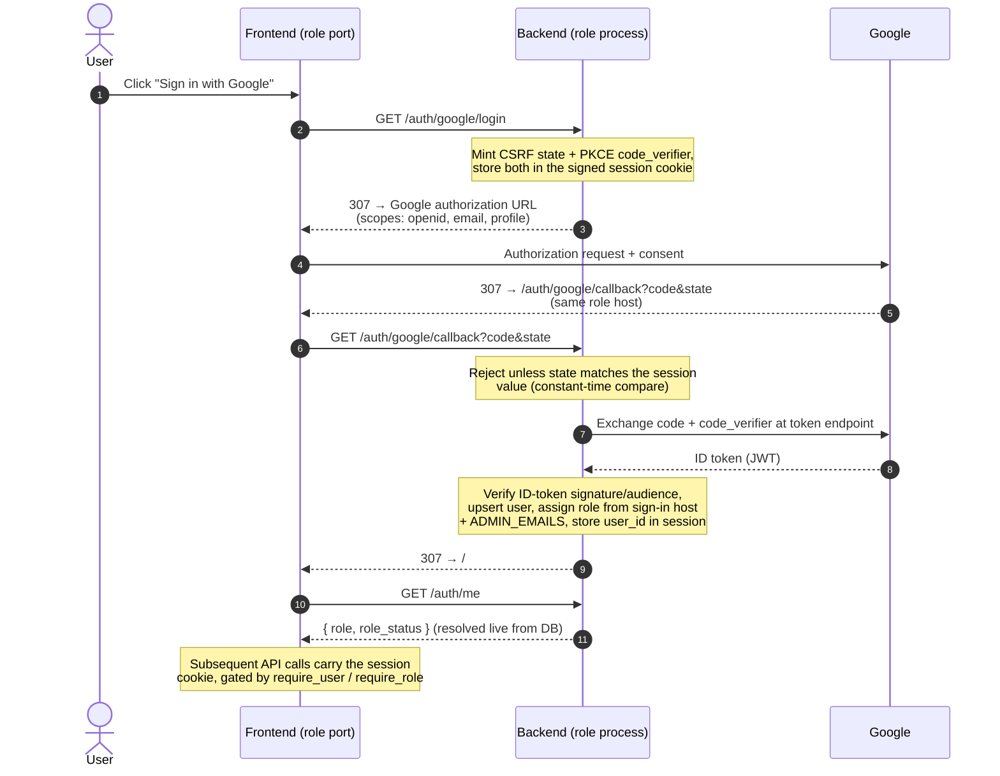
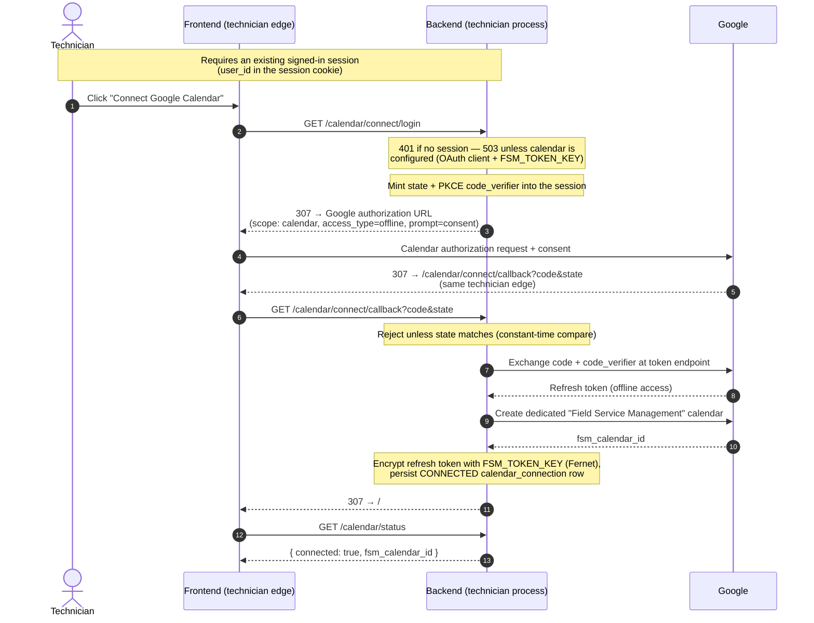

# Security & authentication

Google OIDC is the only sign-in path, and every booking and scheduling route requires a signed-in
session — there is no anonymous access and no password store to protect. This page describes how a
session is established and the properties the design relies on.

## Authentication sequence

Each role runs as its own process behind its own host (`localhost:8001` technician, `:8002`
customer, `:8003` back office). The process that starts a sign-in also finishes it: the callback URL
is derived from the host the request arrived on, so a flow begun on `:8003` returns to `:8003`. The
session is a signed cookie (`SESSION_SECRET`); the server keeps no session table.

## Technician calendar connect

Connecting a technician's Google Calendar is a second OAuth consent, separate from sign-in: it shares
the same OAuth client but requests the broad Google Calendar scope and uses its own redirect URI
(`/calendar/connect/callback`). It is gated only on an existing signed-in session — the technician
must already be authenticated — and the refresh token Google returns is encrypted at rest with
`FSM_TOKEN_KEY` before it is stored, so the database never holds a usable token in plaintext.

## Properties the design relies on

- **CSRF on the OAuth handshake.** `/auth/google/login` mints a random `state` into the session and
  the callback rejects any mismatch with a constant-time compare. A PKCE `code_verifier` rides the
  same session so the separately-built callback flow can complete the exchange.
- **Sessions are signed, not stored.** The cookie carries only `user_id`; `SESSION_SECRET` signs it.
  Blank `SESSION_SECRET` means no session middleware is mounted and every sign-in fails.
- **Role and status are read live.** The session holds only `user_id`; `/auth/me` re-resolves
  `role` and `role_status` from the database on every call, so a just-approved technician advances
  without re-authenticating, and a revoked one loses access on their next request.
- **Roles come from the process, not the client.** The role is assigned from the `FSM_ROLE` of the
  process that completes the callback — each role runs as its own process behind its own edge host.
  The back-office role additionally requires the email to be in `ADMIN_EMAILS`; other edges fall back
  to the customer/technician funnels. There is no client-supplied role.
- **Refresh tokens are encrypted at rest.** A technician's stored Google refresh token is encrypted
  with `FSM_TOKEN_KEY`; rotating that key makes existing calendar connections undecryptable.
- **Live streams are entitlement-bounded.** The SSE stream subscribes a connection only to the
  channels its caller owns (`user:{id}`, plus `admins` for an approved administrator), so a client
  cannot listen in on back-office events by asking. See [communication.md](communication.md).

## Running a role across several replicas

A role's funnel is fixed by its `FSM_ROLE`, so any number of replicas of the same role (for example
several customer instances behind a load balancer) all resolve to the same `SignInHost` — replication
never changes which role a sign-in grants. Two infrastructure conditions make it safe:

- **Share `SESSION_SECRET` across every replica.** The session is a signed cookie with no server-side
  store, and the OAuth `state` and PKCE `code_verifier` ride inside it. A login that begins on one
  replica and whose callback lands on another completes correctly as long as both verify with the same
  secret — so **sticky sessions are not required**, even for the OAuth handshake.
- **Set `REDIS_URL`.** With more than one process the in-process event bus cannot reach across
  replicas; the Redis bus fans each SSE event out to subscribers on every replica, so a client
  connected to one instance still receives events published by another. See
  [communication.md](communication.md).

One constraint is not about role funnels: the background calendar workers (`FSM_DISPATCH_ENABLED` /
`FSM_SYNC_ENABLED`) must be owned by exactly one process. When the back office runs as several
replicas, enable the workers on one and leave them off on the rest, or they will each drain the shared
calendar outbox and poll Google redundantly. Customer and technician replicas never touch those flags.

Per-key configuration — what each secret does and how to obtain the Google credentials — lives inline
in [`backend/.env.example`](../backend/.env.example).
