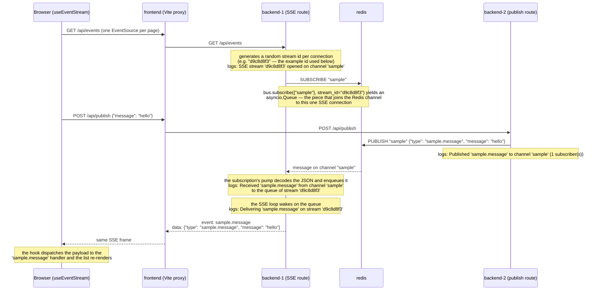

# Redis event bus + SSE sample

A narrowed stack for one mechanism of the main application: an event published in one backend
process reaching an SSE stream held open by another, through the Redis pub/sub broker. Everything
generic is imported from the application, not copied — the backends use `fsm.core.events`
(`build_event_bus`, `RedisEventBus`) from the `fsm-backend:local` image, and the page uses the
shared-EventSource hook `frontend/src/hooks/useEventStream.ts`.

## Flow



`backend-1` and `backend-2` run the identical sample app (`backend/app.py`), which serves both a
publish route and an SSE route. The Vite proxy is what assigns roles: it pins the page's SSE
stream to backend-1 and the publish POST to backend-2, so every posted message must cross
processes through Redis before it reappears on the page. The sample uses one fixed channel
(`sample`) where the application derives per-user and admins channels from the session — channel
naming is the application's job, not the transport's.

## Run

```bash
docker compose up --build
```

Then open <http://localhost:8010>, type a message, and post it. It should appear in the list below
the form immediately — delivered via the SSE stream, not the POST response.

The logs show the full path, tied together by the delivery-trace ids:

```bash
docker compose logs backend-1 backend-2
# backend-2  ... Published 'sample.message' to channel 'sample' (1 subscriber(s))
# backend-1  ... Received 'sample.message' from channel 'sample' to the queue of stream '<id>'
# backend-1  ... Delivering 'sample.message' on stream '<id>'
```

## Test

```bash
./test.sh
```

The script does what the page does, against the real stack. It starts the compose stack unless one
is already running, opens the SSE stream, posts a message, and passes only if the message comes
back on the stream and the logs show the publish on backend-2 and the delivery on backend-1. On
success it prints those log lines in timestamp order. If the script started the stack it also
shuts it down at the end; a stack you started yourself is left running.

A second, faster check needs no Docker at all. It runs the sample app in-process with the
in-memory bus standing in for Redis, posts to the publish route, and asserts the event reaches a
subscriber of the `sample` channel. It borrows the main backend's virtualenv, since the sample
installs nothing of its own:

```bash
cd backend && ../../../backend/.venv/bin/pytest test_app.py
```
